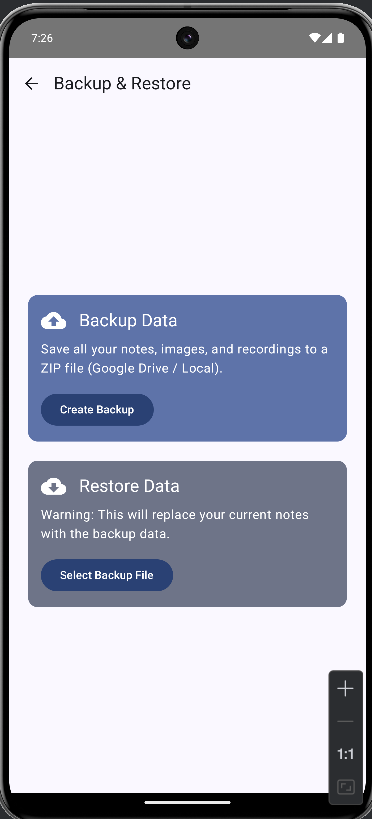
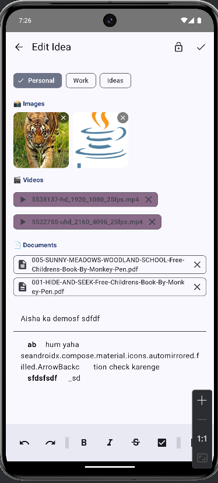

# 🧠 DigitalMemory - Your Personal Second Brain

**DigitalMemory** is a modern, offline-first Android application designed to act as your personal knowledge vault. It allows you to capture thoughts, organize ideas, and attach multimedia securely.

Built with **Modern Android Development** standards using Kotlin and Jetpack Compose.

## 📱 Screenshots

| Import export (Grid) | Dashboard | Attachments | Security Lock |
|:---:|:---:|:---:|:---:|
|  |  |  |  |

## ✨ Key Features

- **📝 Rich Text Editor:** Format notes with **Bold**, *Italic*, Underline, Strikethrough, and Lists.
- **📂 Multimedia Support:**
  - 📸 Attach Images (Gallery Picker).
  - 🎤 Record Voice Notes instantly.
  - 🎬 Attach Videos & PDF Documents.
  - 🔗 Smart Hyperlinks for all attachments.
- **☁️ Universal Backup:** Import/Export your entire data (Database + Files) as a ZIP file. Works with Google Drive, WhatsApp, or Local Storage.
- **🔐 Privacy First:** Secure your private thoughts with **Biometric Lock** (Fingerprint/Face ID).
- **🎨 Modern UI:**
  - Beautiful **Staggered Grid** layout (Pinterest style).
  - Switch between **Grid & List** views.
  - Collapsible media sections.
- **🛡️ Safety:** Recycle Bin with Restore functionality.
- **🔍 Smart Search:** Deep search within notes content.
- **⏰ Reminders:** Set local push notifications for important notes.

## 🛠️ Tech Stack & Architecture

- **Language:** Kotlin 100%
- **UI:** Jetpack Compose (Material Design 3)
- **Architecture:** MVVM (Model-View-ViewModel) with Clean Architecture principles.
- **Database:** Room Database (SQLite abstraction) with TypeConverters.
- **Async Programming:** Coroutines & Kotlin Flows.
- **Dependency Injection:** Manual Dependency Injection (Factory Pattern).
- **Hardware Integration:**
  - `Camera/Gallery` (Photo Picker)
  - `Microphone` (MediaRecorder API)
  - `Biometrics` (BiometricPrompt API)
  - `File System` (Storage Access Framework - SAF)
  - `AlarmManager` (Exact Alarms)

## 🚀 How to Run

1. Clone the repository:
   ```bash
   git clone [https://github.com/your-username/DigitalMemory-Android.git](https://github.com/your-username/DigitalMemory-Android.git)
